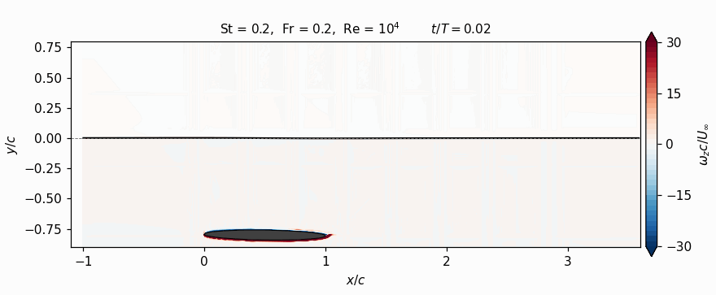
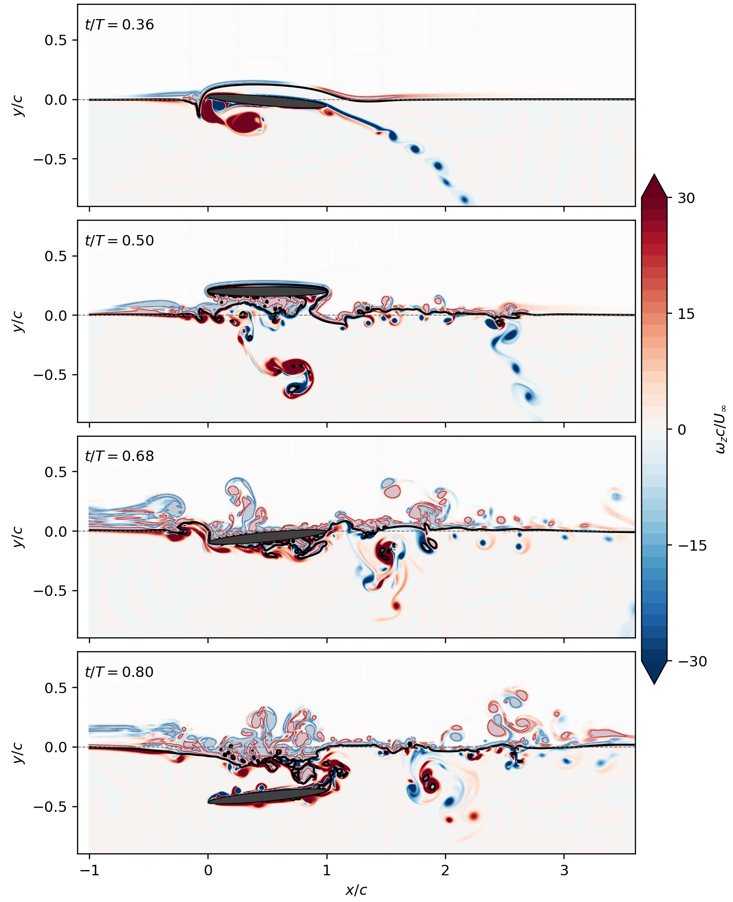
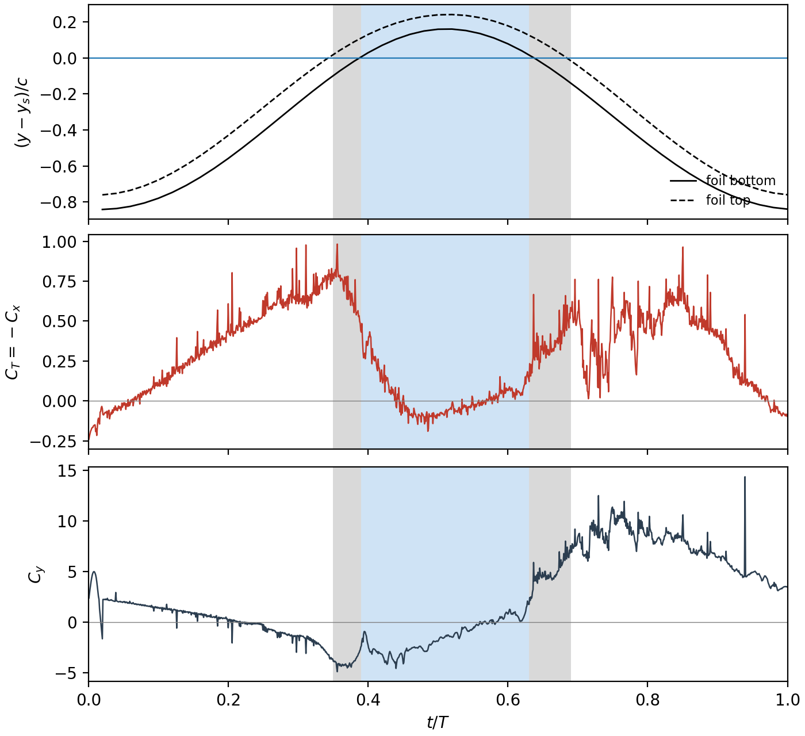
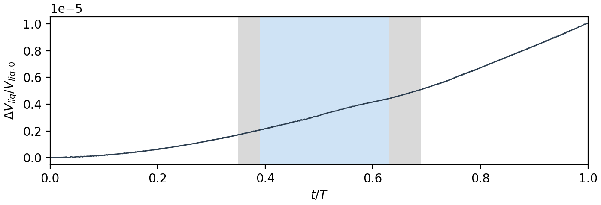

# Two-Phase Flow with a Moving Immersed Boundary: A Flapping Foil Piercing the Free Surface

This repository shows code-development work I did at **Johns Hopkins University** in Prof. Rajat Mittal's group. The work extends the group's in-house solver **VICAR3D**, a parallel, sharp-interface immersed-boundary Navier–Stokes code, to air–water flows with a moving body that crosses the free surface.

> **About the code.** The solver belongs to Prof. Mittal's group, so no solver code is included here. This repository contains only a short description of the method, results from one production simulation, and verification and HPC data.

<p align="center">
  
</p>

*A heaving and pitching elliptic foil (St = 0.2, Fr = 0.2, Re = 10⁴) rises out of the water, travels through the air, and plunges back in. Colour shows spanwise vorticity ω_z c/U∞; in the air phase it is faded. The black line is the free surface (volume fraction φ = 0.5), and the dashed line is the still-water level.*

---

## 1. Numerical formulation

The air and water are solved as one incompressible fluid whose density and viscosity vary through a volume-fraction field φ:

```math
\nabla\cdot\mathbf{u} = 0
```

```math
\rho\left(\frac{\partial \mathbf{u}}{\partial t} + \mathbf{u}\cdot\nabla\mathbf{u}\right)
= -\nabla p
+ \frac{1}{Re}\nabla\cdot\left[\mu\left(\nabla\mathbf{u} + \nabla\mathbf{u}^{T}\right)\right]
+ \frac{\rho}{Fr^{2}}\,\hat{\mathbf{g}}
+ \frac{1}{We}\,\kappa\,\nabla\phi
```

The equations are nondimensionalised with the water properties, the chord *c* and the freestream speed *U*∞, giving Re = ρ_w U∞ c / μ_w, Fr = U∞ / √(gc) and We = ρ_w U∞² c / σ.

What I developed on top of the existing single-phase immersed-boundary solver:

- **Interface capturing.** I added algebraic VOF transport of φ, with a fifth-order WENO scheme written for non-uniform Cartesian grids. The same scheme is used for momentum convection.
- **Interface regularisation (ACDI).** I added the accurate conservative diffuse-interface (ACDI) regularisation of Jain (2022), which keeps the interface about one cell thick and stops it from breaking up into a spray of partly filled cells. The mass flux that the regularisation adds is also carried in the momentum equation, so mass and momentum are transported consistently.
- **Variable-density projection.** I wrote a fractional-step method with a density-weighted pressure Poisson equation. It is face-consistent: the face density used in the Poisson operator and in the velocity correction is the same. I also added a reduced-pressure treatment of gravity, so the hydrostatic part of the pressure is removed.
- **Surface tension.** I implemented a balanced-force continuum-surface-force (CSF) model, evaluated at the cell faces with the same discrete operators as the pressure correction.
- **Moving body and contact line.**
  - Phase-aware treatment of "fresh" cells, the fluid cells a moving body has just uncovered.
  - A static contact-angle condition applied where the interface meets the immersed boundary.
- **Prescribed foil motion.** Heave and pitch, with a smooth start-up ramp.
- **Outflow sponge.** A smooth damping zone near the outlet that absorbs outgoing waves.

---

## 2. Showcase: foil piercing the free surface

### 2.1 Configuration

| | |
|---|---|
| Body | 8%-thick elliptic foil, chord *c* = 1 |
| Kinematics | Heave A = 0.5c, pitch 6°, 90° phase, **St = 0.2** |
| Position | The foil starts 0.76c below the still-water level and rises to **0.24c above it** |
| Flow | Re = 10 000, **Fr = 0.2**, We = 1323 |
| Phases | Density ratio 100 : 1, viscosity ratio 100 : 1 |
| Contact angle | 70° |
| Interface | ACDI regularisation, velocity scale Γ = 7 U∞, interface thickness ≈ one cell |
| Domain / grid | 250c × 95c (2-D); 1000 × 950 non-uniform cells, about 207 cells per chord near the foil and interface |
| Time step | Δt = 2 × 10⁻⁴ (25 000 steps per flapping cycle) |

### 2.2 The four phases of the stroke

<p align="center">
  
</p>

| t/T | Phase | What happens |
|---|---|---|
| **0.36** | Exit | The upper surface has broken through. A thin water film is carried up over the foil, while the leading-edge vortex and a long shear layer stay in the water. |
| **0.50** | In air | The foil is fully in air at the top of the stroke. The film has drained off, leaving a disturbed surface beneath it, and the vortex pair from the upstroke travels down and downstream in the water. |
| **0.68** | Re-entry | The foil plunges back in and carries pockets of air down along its lower surface. A vortex pair is shed into the water behind the trailing edge. |
| **0.80** | Submerged | The foil is fully back in the water. The surface above it is pulled down into a trough that ends in an air cavity above the trailing edge. |

In the air, vorticity stays in thin layers close to the surface. Without the ACDI regularisation the interface breaks up into partly filled cells at re-entry and spurious vorticity fills the air above it; with ACDI the air-side enstrophy at re-entry is 55–74% lower.

Individual frames are in [`figures/`](figures/).

### 2.3 Forces through the exit and re-entry

<p align="center">
  
</p>

Grey bands mark when the foil is crossing the still-water level. The blue band marks when it is entirely in air. C_y includes the buoyancy of the still water, which the reduced-pressure formulation leaves out of the computed pressure force (+3.14 when the foil is fully submerged).

- **Thrust collapses in air.** The thrust coefficient C_T rises to about 0.8 at the end of the submerged upstroke and falls to about −0.1 while the foil is in air. It recovers only after re-entry, to 0.5–0.7 in the downstroke. The foil makes almost no thrust for about a quarter of the cycle; the mean over the cycle is C_T = 0.28.
- **Re-entry brings the largest vertical loads.** The vertical force coefficient C_y goes from about −1.4 on average in air to about +5 at re-entry, then to about +11 (with a spike to 14) in the submerged downstroke that follows.
- **The exit leaves a sharp signature.** As the lower surface breaks through (t/T ≈ 0.39), C_y jumps by about 3.5 within one hundredth of a cycle.

*These are first-cycle results (t/T = 0–1), so they include start-up transients.*

---

## 3. Verification and HPC

### 3.1 Conservation and stability

| Metric | Value |
|---|---|
| Liquid-volume change over the run | 1.0 × 10⁻⁵ relative (open domain with inflow and outflow) |
| Volume fraction φ in the fluid | Stays within [0, 1] |
| Maximum CFL | 0.74 |
| Maximum divergence after projection | 2 × 10⁻⁸ |

<p align="center">
  
</p>

The liquid volume drifts smoothly, and the drift shows no jump as the foil leaves or re-enters the water.

### 3.2 Controlled tests behind design decisions

**Surface-tension form.** A mathematically equivalent "conservative" form of the CSF force needs a third derivative of φ. Near the foil it produced single-cell spikes on the interface. The balanced-force face form removes them and gives the same roughness as a run with surface tension switched off, at the same time t = 0.3:

| Capillary force | Near-foil interface roughness | Isolated spikes |
|---|---|---|
| Conservative form | 1.1 × 10⁻³ | 62 |
| None (control) | 8.4 × 10⁻⁶ | 0 |
| **Balanced-force, at faces** | **8.2 × 10⁻⁶** | **0** |

**Face-consistent pressure correction.** Making the cell-centre velocity correction use the same face densities as the Poisson operator removed a 4–5× per-step growth in velocity in gas cells at the interface. Applying the same correction to the cells next to the immersed boundary turned a case that had diverged (CFL → 10³⁷) into one that runs stably at CFL ≈ 0.18.

### 3.3 HPC

| | |
|---|---|
| Machine | **Rockfish** cluster (JHU ARCH), Intel compilers and Intel MPI |
| Parallelisation | MPI domain decomposition, **96 ranks** on 2 nodes |
| Cost | About **5.6 s per step** for 0.95 M cells; one 24-hour job advances about 15 000 steps |
| Bottleneck | The variable-density pressure Poisson solve, about 95% of each step's cost |
| Workflow | Chains of checkpoint/restart runs across 24-hour jobs, and campaign scripts that run a 7-case Fr × St matrix in parallel |

---

## 4. Context

This case is part of a parametric study of **flapping-foil propulsion near and through a free surface**:

- Froude numbers 0.1, 0.2 and 0.4
- Strouhal numbers 0.1, 0.2 and 0.3
- several submergence depths

The aim is to understand how wave-making, ventilation and surface piercing change thrust and efficiency. This matters for bio-inspired swimmers and for propulsors that work close to the surface.

**Acknowledgements.** VICAR3D was developed in Prof. Rajat Mittal's group at Johns Hopkins University. The simulations ran on the Rockfish cluster at JHU's Advanced Research Computing (ARCH).

---

## License

The text and figures in this repository are released under the [Creative Commons Attribution 4.0 International License](LICENSE) (CC BY 4.0). You may share and adapt them with attribution. The VICAR3D solver is not part of this repository and is not covered by this license.
